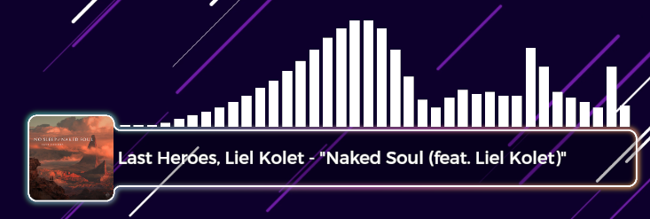

# Streamplify
Get your current playing Spotify track to use on your OBS stream!



- [Streamplify](#streamplify)
  - [Installation](#installation)
  - [Updating](#updating)
  - [Configuration](#configuration)
    - [Spotify API](#spotify-api)
    - [Config file](#config-file)
    - [OBS configuration](#obs-configuration)
      - [Local file](#local-file)
      - [Local server](#local-server)

## Installation

```bash
# Clone the project
git clone https://github.com/nalo26/Streamtify.git
cd Streamtify
# Copying the configuration file
cp .env.example .env
```

See the [configuration](#configuration) section to see how to make it work.

## Updating

```bash
# For Windows
.venv\Scripts\activate
pip install -r requirements.txt

# For Linux
source .venv/bin/activate
pip install -r requirements.txt
```

## Configuration

There is a bunch of steps to follow in order to allow the application to listen to your Spotify activity, and then configuring everything as you need.

### Spotify API

Go to your [Spotify developer dashboard](https://developer.spotify.com/dashboard) and click on `Create app`.

Give it a name and description (for you to remember what it does), ignore website, and in the `Redirect URIs`, set a local address, like `http://localhost:16052`. You can change the port (numbers) for anything between 1000-60000.

You don't have to check any option that come up next, except the Agreements, and then click on the `Save` button.

On the new page, you can click on `edit` to copy the `Client ID`, and click on `View client secret` to copy it too.

Report those 3 values (`Client ID`, `Client Secret` and `Redirect URI`) to the 3 corresponding values of the config file.

### Config file

Copy the example configuration file to edit it:

```bash
# For Windows
copy .env.example .env

# For Linux
cp .env.example .env
```

Here's the whole configuration file with every value explained:

```bash
# The three values to config the access to the Spotify API (see # Spotify-API)
SPOTIPY_CLIENT_ID="Add your client id here"
SPOTIPY_CLIENT_SECRET="Add your client secret here"
SPOTIPY_REDIRECT_URI="http://localhost:16052"

# Weither the current track should be printed on the console as well
CONSOLE_ECHO=0  # 0: off, 1: on

# The time between two calls to the API to refresh the current track
REFRESH_RATE=5  # seconds

# The size of the cover image to use
COVER_SIZE=1  # 0: small (64px), 1: medium (300px), 2: large (640px)

# Formated output to use. You can format it as you want
# You can use one, any or all of the variables:
# {TITLE} title of the track
# {ARTIST} artists of the track, separeted by comma (,)
# {CURRENT} current time in song, formated as MM:SS
# {DURATION} total length of song, formated as MM:SS
OUTPUT_FORMAT="\"{TITLE}\" - {ARTIST} ({CURRENT}/{DURATION})"

# What export system you like
# Local file (0) : will save track and cover on files on your system
# Local server (1) : will create a local HTTP server you can access
#                    to get the track and cover (refresh automaticaly)
EXPORT_FORMAT=0  # 0: local files, 1: local server

# < FILE EXPORT >
# If you choose Local file (0) above, this is the path of the folder you
# want the output to be in (relative or absolute path)
OUTPUT_FOLDER="output"

# The name of the track and cover files, inside the output folder defined above 
OUTPUT_FILE="track.txt"
OUTPUT_COVER="cover.jpg"

# < LOCAL SERVER >
# If you choose Local server (1) above, this is the host and port of your server
# If you plan to only use it on your computer (mostly), you can let the default host
# The server will be available at http://HOST:PORT (e.g http://localhost:16053)
SERVER_HOST="127.0.0.1"  # localhost

# You can change this to whatever value you want in range 1000-60000
SERVER_PORT=16053
```

### OBS configuration

Depending on the `EXPORT_FORMAT` value you defined on the [Config file](#config-file), refer to the associate section: Either [Local file](#local-file) if you set `0`, or [Local server](#local-server) if you set `1`.

#### Local file

On your scene, add new `Text` sources for the track, or `Image` source for the cover.

For the track, configure the font style (family, size & color) as you wish, and then select the `Read from a local file` option.

Configure the path to be the same as the one configured in `OUTPUT_FOLDER` and `OUTPUT_FILE` for the track, or `OUTPUT_COVER` for the cover.

> [!TIP]
> If I have defined `OUTPUT_FOLDER` to `C:/Users/<user>/Desktop/output` and `OUTPUT_FILE` to `track.txt`, I will fill the file path to `C:/User/<user>/Desktop/output/track.txt`

> [!WARNING]
> The OBS render of local files can sometimes **stop being refreshed**. This is caused by the way OBS caches the file to avoid having to do a lot of file-reading operation.  
> The temporary solution is to refresh the source by hiding it and then showing it back.

#### Local server

On your scene, add new `Browser` sources.

Set the URL as the data you want to fetch, as follow: `http://localhost:<PORT><SOURCE>`.  
- `<PORT>` is the value you defined in `SERVER_PORT` of the [Config file](#config-file) (i.e. `16053`)
- `<SOURCE>` is the data you're interested in. It can be:
  - `/` - A full pre-render (cover & track rendered as defined in `OUTPUT_FORMAT`)
  - `/track` - The track render (as defined in `OUTPUT_FORMAT`)
  - `/title` - The title text only
  - `/artist` - The artist text only
  - `/cover` - The cover image only (with its size as defined in `COVER_SIZE`)

> [!TIP]
> If I want to add a source for the track render, I will setup the URL as `http://localhost:16053/track`.

You can define the `Width` and `Height` parameters as you need, it will depends on the font size for the text. For the `/cover`, I recommend to set those to the width of the cover as defined in `COVER_SIZE`

For the text data (`/track`, `/title` & `/artist`), you will surely **need to adjust the style** of the page to fit your needs (font family & size, color).

> [!TIP]
> Here's one example to set the background transparent, use the 40px Montserrat font colored to white. 
> ```css
> body { background-color: rgba(0, 0, 0, 0); margin: 0px auto; overflow: hidden; }
> p {
>   font-family: Montserrat, Arial, Helvetica, sans-serif;
>   font-size: 40px;
>   color: white;
> }
> ```
> I set the Width to 1200, and Height to 100 using this example.  
> For the cover, I use no custom CSS, and defined the Width and Height to 300.